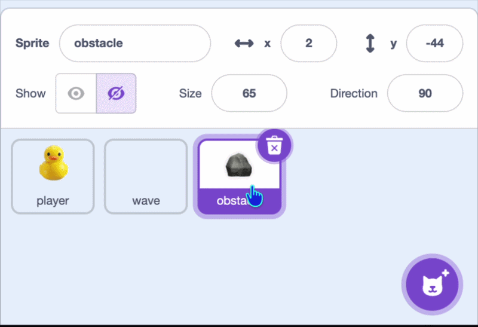
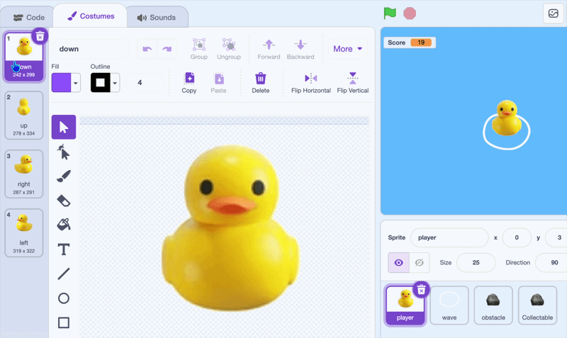

## Collectables

In this step, you'll collect the lost ducks for points. You can duplicate the rock sprite and reuse its blocks.

> [!TASK]
>
> {:width="150"}
>
> Right-click your **rock** sprite and duplicate it. Rename the copy **collectable**.
>
> {:width="450"}

> [!TASK]
>
> Give it a duck costume — copy one over from your duck sprite, or make a different one of your own.
> 
> {:width="450"}

> [!TASK]
>
> In `when I start as a clone`{:class="block3control"}, under the `disappear`{:class="block3myblocks"} block, add an `if then`{:class="block3control"} and drag in a `touching?`{:class="block3sensing"}. Choose **player** from the drop-down.
>
> ```blocks3
> when I start as a clone
> appear
> forever
> move
> disappear
> +if <touching (player v)?> then
> end
> end
> ```

> [!TASK]
>
> Make a variable called `score`{:class="block3variables"} and tick its checkbox so it shows on the stage.
>
> {:width="300"}

> [!TASK]
>
> Set `score`{:class="block3variables"} to `0` at the start of the `green flag`{:class="block3events"} script, so it resets each game.
>
> ```blocks3
> when green flag clicked
> set [rock speed v] to (3)
> +set [score v] to (0)
> hide
> forever
> if <key (any v) pressed?> then
> create clone of (myself v)
> end
> wait (pick random (1) to (3)) seconds
> end
> ```

> [!TASK]
>
> Add a `change score by 1`{:class="block3variables"} so the score goes up when a duck is collected.
>
> ```blocks3
> forever
> move
> disappear
> if <touching (player v)?> then
> +change [score v] by (1)
> end
> end
> ```

> [!TASK]
>
> Make a sound for collecting a duck. Open the **Sounds** tab.
>
> {:width="450"}

> [!TASK]
>
> Click **Choose a Sound** and pick one from the library.
>
> {:width="250"}

> [!TASK]
>
> Back in the **Code** tab, add a `start sound`{:class="block3sound"} block and choose your sound.
>
> ```blocks3
> forever
> move
> disappear
> if <touching (player v)?> then
> change [score v] by (1)
> +start sound (Glug v)
> end
> end
> ```

> [!TASK]
>
> Finally, `delete this clone`{:class="block3control"} so the duck looks like it's been collected.
>
> ```blocks3
> forever
> move
> disappear
> if <touching (player v)?> then
> change [score v] by (1)
> start sound (Glug v)
> +delete this clone
> end
> end
> ```

**Test:** Swim into a duck. Your score goes up and the duck disappears with a sound.
