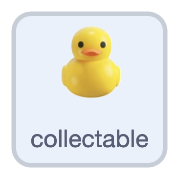

## Collect the ducks

In this step, you'll add ducks to collect for points.

> [!TASK]
>
> {:width="150"}
>
> Right-click your `rock` sprite and duplicate it. Rename the copy `collectable duck` and give it a duck costume. It already knows how to appear and drift — you'll just change what happens when your `player` reaches it.

> [!TASK]
>
> Make a `Score`{:class="block3variables"} variable and tick its checkbox so it shows on the stage. In the collectable duck's `green flag`{:class="block3events"} script, set the score to 0 at the start.
>
> ```blocks3
> when green flag clicked
> set [rock speed v] to (3)
> +set [Score v] to (0)
> hide
> go to back layer
> ```

> [!TASK]
>
> In its `when I start as a clone`{:class="block3control"} loop, add a check: if it's `touching (player v)?`{:class="block3sensing"}, add to the score, play a sound, and delete the clone.
>
> ```blocks3
> when I start as a clone
> forever
> +if <touching (player v)?> then
> +change [Score v] by (1)
> +start sound (Glug v)
> +delete this clone
> end
> end
> ```

**Test:** Swim into a duck. Your score goes up and the duck disappears with a sound.
