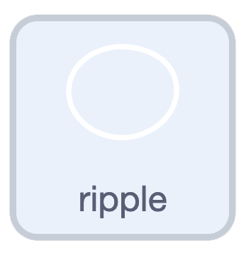

## Challenge: add ripples

Make your duck look like it's really floating by adding ripples around it.

> [!CHALLENGE]
>
> {:width="150"}
>
> Make a new `ripple` sprite with a couple of ripple costumes, and sit it just below your duck.

> [!CHALLENGE]
>
> When your duck is resting, show gentle ripples — a `forever`{:class="block3control"} loop that shows the ripple and goes to the `next costume`{:class="block3looks"} every so often.

> [!CHALLENGE]
>
> When your duck is moving, show bigger, faster ripples. Check `key (any v) pressed?`{:class="block3sensing"} and change costume more quickly.

> [!HINT]
>
> Here's one way to do both in a single loop:
>
> ```blocks3
> when green flag clicked
> forever
> if <key (any v) pressed?> then
> show
> next costume
> wait (0.1) seconds
> else
> show
> next costume
> wait (0.4) seconds
> end
> end
> ```
