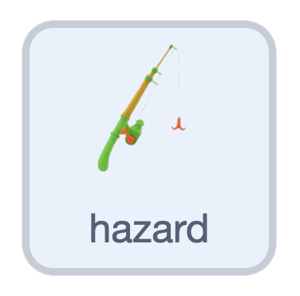
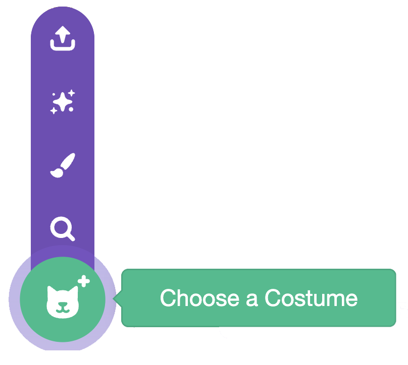

## Add a hazard

In this step, you'll add a hazard your duck has to dodge, or it ends the game. The example uses a hook, but it could be other wildlife, sea rubbish, or something else you choose.

> [!TASK]
>
> Right-click your **collectable** sprite and duplicate it. Rename the copy **hazard**.
>
> {:width="450"}

> [!TASK]
>
> {:width="150"}
>
> Change its costume. Choose one from the library, or upload your own hook image.
>
> {:width="300"}

> [!TASK]
>
> A hazard shouldn't score points. Right-click the `change score`{:class="block3variables"} block and delete it.
>
> {:width="450"}

> [!TASK]
>
> Give your hazard a different sound. Open the **Sounds** tab.
>
> {:width="450"}

> [!TASK]
>
> Click **Choose a Sound** and pick one from the library — the hook uses a "Rip" noise.
>
> {:width="250"}

> [!TASK]
>
> Back in the **Code** tab, change the `start sound`{:class="block3sound"} to your new one.
>
> ```blocks3
> when I start as a clone
> appear
> forever
> move
> disappear
> if <touching (player v)?> then
> +start sound (Rip v)
> delete this clone
> end
> end
> ```

> [!TASK]
>
> Now make the game end when the hazard catches your duck. Swap the `delete this clone`{:class="block3control"} for a `stop all`{:class="block3control"}, and add a short `wait`{:class="block3control"} so the sound can finish.
>
> ```blocks3
> if <touching (player v)?> then
> start sound (Rip v)
> +wait (0.2) seconds
> +stop [all v]
> end
> ```

**Test:** Swim around and check the game ends when your duck hits a hazard.

> [!TASK]
>
> To make it harder, send each hazard off in a random direction. In your `appear`{:class="block3myblocks"} block add a `point in direction`{:class="block3motion"} with `random`{:class="block3operators"} angles.
>
> ```blocks3
> define appear
> +point in direction (pick random (-180) to (180))
> go to x: (pick random (-240) to (240)) y: (pick random (-180) to (180))
> set size to (pick random (20) to (100)) %
> show
> ```

> [!TIP]
>
> The example uses `-180` to `180` for the angle, but you can experiment with the range.

**Test:** The hazards drift around, and the game ends when your duck hits one.
