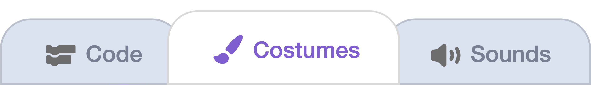
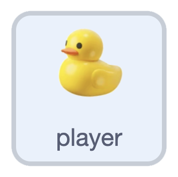
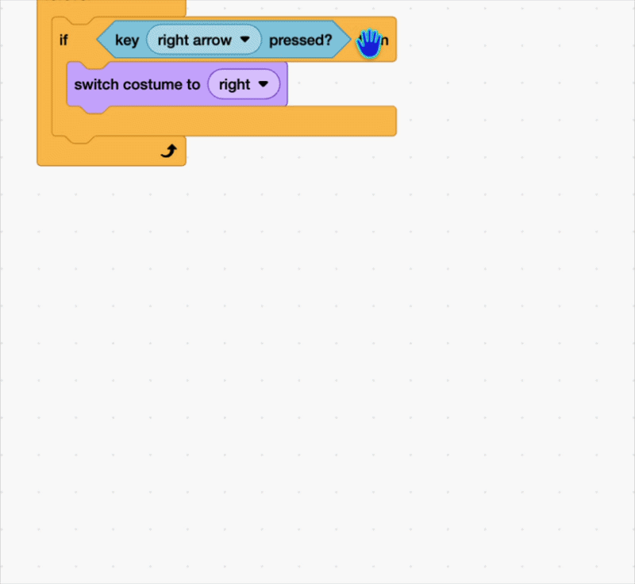

## Move the duck

In this step, you will use the arrow keys to turn the duck.

> [!TASK]
>
> Open the [starter project](https://scratch.mit.edu/projects/1366224959/editor){:target="_blank"}. Sign in to your Scratch account, then select **remix**.
>
> {:width="200"}

> [!TIP]
>
> The **remix** button only appears when you are signed in.

Your duck is already on the stage. It's sprite is called **player**.

> [!TASK]
>
> Open the **Costumes** tab to see your duck's costumes. These are labelled up, down, left, and right.
>
> {:width="450"}

> [!TIP]
>
> If you'd rather use your own sprite, **choose**, **paint**, or **upload** one. It needs a costume for each direction: up, down, left, and right.

> [!TASK]
>
> {:width="150"}
>
> Go back to the **code tab** and set up the starting position. Add a `green flag`{:class="block3events"} block. Bring the duck to the `front layer`{:class="block3looks"}, `switch costume`{:class="block3looks"} to down, and put it in the middle of the stage.
>
> ```blocks3
> when green flag clicked
> go to [front v] layer
> switch costume to (down v)
> go to x: (0) y: (0)
> ```

Use the arrow keys to turn the duck.

> [!TASK]
>
> Add a `forever`{:class="block3control"} loop with an `if then`{:class="block3control"} block inside. Drag in a `key pressed`{:class="block3sensing"}, and choose right arrow. 
> ```blocks3
> when green flag clicked
> go to [front v] layer
> switch costume to (down v)
> go to x: (0) y: (0)
> +forever
> if <key (right arrow v) pressed?> then
> end
> end
> ```

> [!TASK]
>
> Inside the `if`{:class="block3control"}, add a `switch costume`{:class="block3looks"} so the duck faces right.
>
> ```blocks3
> forever
> if <key (right arrow v) pressed?> then
> +switch costume to (right v)
> end
> end
> ```

> [!TASK]
>
> Do the same for the other three keys: `left arrow`{:class="block3sensing"} → left, `down arrow`{:class="block3sensing"} → down, and `up arrow`{:class="block3sensing"} → up.
>
> ```blocks3
> forever
> if <key (right arrow v) pressed?> then
> switch costume to (right v)
> end
> +if <key (left arrow v) pressed?> then
> switch costume to (left v)
> end
> +if <key (down arrow v) pressed?> then
> switch costume to (down v)
> end
> +if <key (up arrow v) pressed?> then
> switch costume to (up v)
> end
> end
> ```

> [!TIP]
>
> You can right-click a block to duplicate it.
>
> {:width="450"}

**Test:** Press the arrow keys and check that your duck turns.
