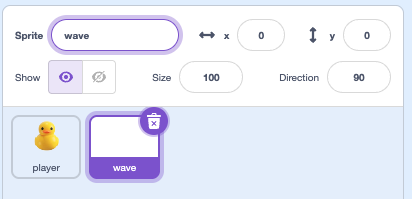
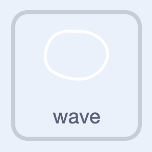
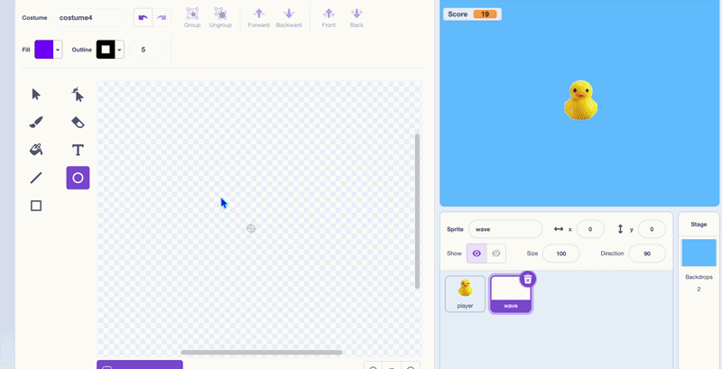
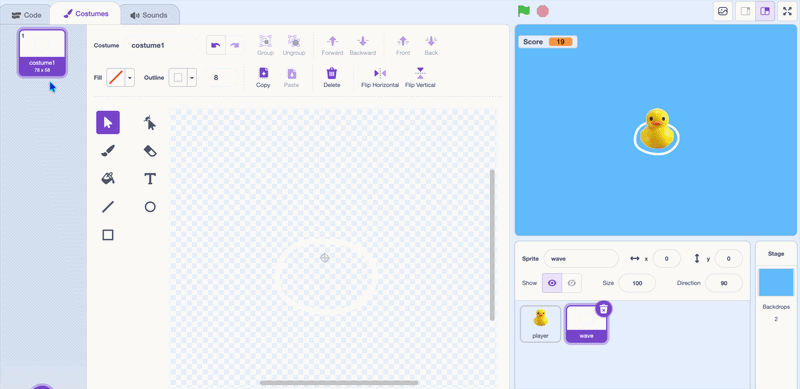

## Make some waves

To make the movement look like it's really in water, you can add a wave that changes as the duck moves.

> [!TASK]
>
> Make a new sprite with the **Paint** sprite icon.
>
> {:width="250"}

> [!TASK]
>
> Name your sprite **wave**.
>
> {:width="450"}


> [!TASK]
>
> {:width="150"}
>
> Use the paint tools to draw a circle. This is the shape of your wave.
>
> Resize it so it is a bit bigger than your duck. Use a white or light colour for the outline, and remove the fill.
>
> {:width="350"}

> [!TASK]
>
> Go to the **Code** tab. Set the wave up with a `green flag`{:class="block3events"}, send it to the back, and position it just below the duck.
>
> ```blocks3
> when green flag clicked
> go to [back v] layer
> go to x: (0) y: (-20)
> ```


> [!TASK]
>
> Start with idle movement.
>
> Add an `if else`{:class="block3control"} block inside a `forever`{:class="block3control"} loop. Add blocks into the `else`{:class="block3control"} part that gently moves the wave the opposite way to the duck.
>
> ```blocks3
> when green flag clicked
> go to [back v] layer
> go to x: (0) y: (-20)
> forever
> +if <> then
> else
> change y by (-1)
> wait (0.3) seconds
> change y by (1)
> wait (0.3) seconds
> end
> end
> ```

**Test:** The wave bobs the opposite way to your duck, so it looks like it's floating.

Now make an animated version for when the duck moves.

> [!TASK]
>
> Select the **Costumes** tab.
>
> {:width="450"}

> [!TASK]
>
> **Duplicate** the circle and make the new one a bit bigger, then duplicate again and make it bigger still — three costumes in total.
>
> {:width="450"}


> [!TASK]
>
> Drag a `key pressed`{:class="block3sensing"} block into the `if`{:class="block3control"} and choose **any**.
>
> ```blocks3
> when green flag clicked
> go to [back v] layer
> go to x: (0) y: (-20)
> forever
> if <key (any v) pressed?> then
> else
> change y by (-1)
> wait (0.3) seconds
> change y by (1)
> wait (0.3) seconds
> end
> end
> ```

> [!TASK]
>
> In the `if`{:class="block3control"} part, add a `next costume`{:class="block3looks"} and a `wait`{:class="block3control"} to animate the wave while the duck moves.
>
> ```blocks3
> when green flag clicked
> go to [back v] layer
> go to x: (0) y: (-20)
> forever
> if <key (any v) pressed?> then
> +next costume
> +wait (0.1) seconds
> else
> change y by (-1)
> wait (0.3) seconds
> change y by (1)
> wait (0.3) seconds
> end
> end
> ```

> [!TASK]
>
> Finally, add a `switch costume to costume1`{:class="block3looks"} at the top of the `else`{:class="block3control"}, so the idle wave always starts from the smallest circle.
>
> ```blocks3
> when green flag clicked
> go to [back v] layer
> go to x: (0) y: (-20)
> forever
> if <key (any v) pressed?> then
> next costume
> wait (0.1) seconds
> else
> +switch costume to (costume1 v)
> change y by (-1)
> wait (0.3) seconds
> change y by (1)
> wait (0.3) seconds
> end
> end
> ```

**Test:** Make sure the wave bobs gently when the duck is still, and animates when it swims.
