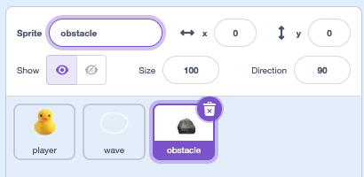

## Add rocks

In this step, you'll add rocks as obstacles that your duck has to swim around. The rocks move in the background, which makes it look like the duck is swimming.

> [!TASK]
>
> Add a new sprite for your rocks — draw one with the paint tools, or choose one from the library.
>
> {:width="250"}

> [!TASK]
>
> Name your sprite **obstacle**
>
> {:width="350"}


> [!TIP]
>
> The rocks in the example are the rock emoji 🪨, copied and pasted into a text box in the **Paint** tab.

> [!TASK]
>
> {:width="150"}
>
> The rocks are made from **clones** — copies of the sprite. Start the script with a `green flag`{:class="block3events"}, hide the original sprite, and create a clone.
>
> ```blocks3
> when green flag clicked
> hide
> create clone of (myself v)
> ```

> [!TASK]
>
> Each rock needs to appear at a random spot. Select **Make a Block** and name it `appear`{:class="block3myblocks"}.
>
> {:width="250"}

> [!TASK]
>
> In the `My Blocks`{:class="block3myblocks"} menu, drag over a `define appear`{:class="block3myblocks"}.
>
> ```blocks3
> define appear
> ```

> [!TASK]
>
> Under `define appear`{:class="block3myblocks"}, add a `go to`{:class="block3motion"} and a `show`{:class="block3looks"}. The example uses `pick random`{:class="block3operators"} for x and y, so each rock appears in a different spot.
>
> ```blocks3
> define appear
> go to x: (pick random (-240) to (240)) y: (pick random (-180) to (180))
> show
> ```

> [!TASK]
>
> You can also give each rock a random size.
>
> ```blocks3
> define appear
> go to x: (pick random (-240) to (240)) y: (pick random (-180) to (180))
> +set size to (pick random (20) to (100)) %
> show
> ```

> [!TASK]
>
> In `when I start as a clone`{:class="block3control"}, drag in your `appear`{:class="block3myblocks"} block.
>
> ```blocks3
> when I start as a clone
> appear
> ```

**Test:** Click the green flag a few times. A rock appears at a different size and spot each time.

The rocks need to appear while the duck is swimming using the arrow keys. To do that, trigger the clone with a key press instead of the green flag.

> [!TASK]
>
> Move the `create clone`{:class="block3control"} into an `if then`{:class="block3control"} block, and drop in a `key pressed`{:class="block3sensing"} set to **any**.
>
> ```blocks3
> when green flag clicked
> hide
> +if <key (any v) pressed?> then
> create clone of (myself v)
> end
> ```

> [!TASK]
>
> Move that into a `forever`{:class="block3control"} loop to keep it going.
>
> ```blocks3
> when green flag clicked
> hide
> +forever
> if <key (any v) pressed?> then
> create clone of (myself v)
> end
> end
> ```

**Test:** Press the arrow keys and see lots of rocks appear at random spots and sizes.

To limit the number of rocks being cloned, add a small delay at the end. This is how often the rocks will appear. 


> [!TASK]
>
> Add a `wait`{:class="block3control"} with a `pick random`{:class="block3operators"}. 
>
> ```blocks3
> when green flag clicked
> hide
> forever
> if <key (any v) pressed?> then
> create clone of (myself v)
> end
> +wait (pick random (1) to (3)) seconds
> end
> ```

**Test:** Press the arrow keys. Rocks should appear at random spots and sizes, with a 1–3 second wait between each one.

> [!TIP]
>
> Experiment with the wait time to make more or fewer rocks appear.
