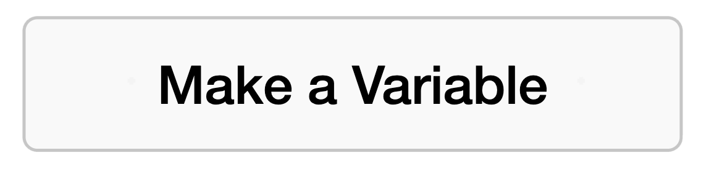
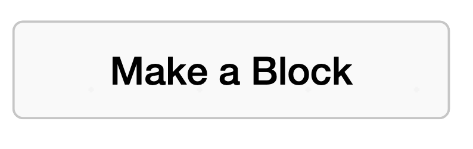

## Move the rocks

The rocks move across the stage, which makes it look like your duck is swimming. 

> [!TASK]
>
> {:width="150"}
>
> Make a variable called **rock speed**.
>
> {:width="250"}

> [!TASK]
>
> Set the speed to `3` at the start of the `green flag`{:class="block3events"} script.
>
> ```blocks3
> when green flag clicked
> +set [rock speed v] to (3)
> hide
> forever
> if <key (any v) pressed?> then
> create clone of (myself v)
> end
> wait (pick random (1) to (3)) seconds
> end
> ```

> [!TASK]
>
> Select **Make a Block** and name it `move`{:class="block3myblocks"}.
>
> {:width="250"}

> [!TASK]
>
> Under `define move`{:class="block3myblocks"}, add an `if then`{:class="block3control"} with a `key pressed`{:class="block3sensing"} check set to the **right arrow**.
>
> ```blocks3
> define move
> if <key (right arrow v) pressed?> then
> end
> ```

> [!TASK]
>
> Move the rock with a `change x by`{:class="block3motion"}. Use a `take away`{:class="block3operators"}, and put a `0` on the left and **rock speed** on the right, so it slides the opposite way to the arrow.
>
> ```blocks3
> define move
> if <key (right arrow v) pressed?> then
> +change x by ((0) - (rock speed))
> end
> ```

> [!TASK]
>
> Add a `forever`{:class="block3control"} loop at the bottom of `when I start as a clone`{:class="block3control"}. Go to the `My Blocks`{:class="block3myblocks"} menu again, and drag your `move`{:class="block3myblocks"} block inside it.
>
> ```blocks3
> when I start as a clone
> appear
> +forever
> move
> end
> ```

**Test:** Hold the right arrow. The rocks slide left — it looks like your duck is swimming to the right.

> [!TASK]
>
> Now add the other three directions to the same `move`{:class="block3myblocks"} block.
>
> ```blocks3
> define move
> if <key (right arrow v) pressed?> then
> change x by ((0) - (rock speed))
> end
> +if <key (left arrow v) pressed?> then
> change x by (rock speed)
> end
> +if <key (down arrow v) pressed?> then
> change y by (rock speed)
> end
> +if <key (up arrow v) pressed?> then
> change y by ((0) - (rock speed))
> end
> ```

**Test:** Hold an arrow key. The rocks slide past — it looks like your duck is swimming.
