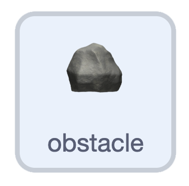

## Block the duck

Right now your duck swims straight through the rocks. In this step, you'll make the rocks block its path.

> [!TASK]
>
> {:width="150"}
>
> In the `player` sprite, make four variables: `right blocked`{:class="block3variables"}, `left blocked`{:class="block3variables"}, `up blocked`{:class="block3variables"}, and `down blocked`{:class="block3variables"}. Untick their checkboxes so they don't show on the stage.

> [!TASK]
>
> Under the switch costume for the `right arrow`{:class="block3sensing"}, add an `if () else`{:class="block3control"} block. Drag in a `touching () ?`{:class="block3sensing"} and choose **obstacle**. Set `right blocked`{:class="block3variables"} to `yes` when it's touching, or `no` when it isn't.
>
> ```blocks3
> if <key (right arrow v) pressed?> then
> switch costume to (right v)
> +if <touching (obstacle v)?> then
> set [right blocked v] to [yes]
> wait (0.5) seconds
> else
> set [right blocked v] to [no]
> end
> end
> ```

> [!TIP]
>
> The `wait (0.5) seconds`{:class="block3control"} gives you a moment to change direction after bumping into a rock.

> [!TASK]
>
> Do the same for the other three arrow keys, using `left blocked`{:class="block3variables"}, `up blocked`{:class="block3variables"}, and `down blocked`{:class="block3variables"}.

> [!TASK]
>
> {:width="150"}
>
> Go to your `rock` sprite. In the `move`{:class="block3custom"} block, make each rock only move when that direction isn't blocked. Add an `and`{:class="block3operators"} to the `right arrow`{:class="block3sensing"} check: `right blocked = no`.
>
> ```blocks3
> define move
> +if <<key (right arrow v) pressed?> and <(right blocked) = [no]>> then
> change x by ((0) - (rock speed))
> end
> ```

> [!TASK]
>
> Do the same for the other three directions.
>
> ```blocks3
> define move
> if <<key (right arrow v) pressed?> and <(right blocked) = [no]>> then
> change x by ((0) - (rock speed))
> end
> if <<key (left arrow v) pressed?> and <(left blocked) = [no]>> then
> change x by (rock speed)
> end
> if <<key (down arrow v) pressed?> and <(down blocked) = [no]>> then
> change y by (rock speed)
> end
> if <<key (up arrow v) pressed?> and <(up blocked) = [no]>> then
> change y by ((0) - (rock speed))
> end
> ```

**Test:** Swim into a rock. Your duck stops instead of sliding through it.
